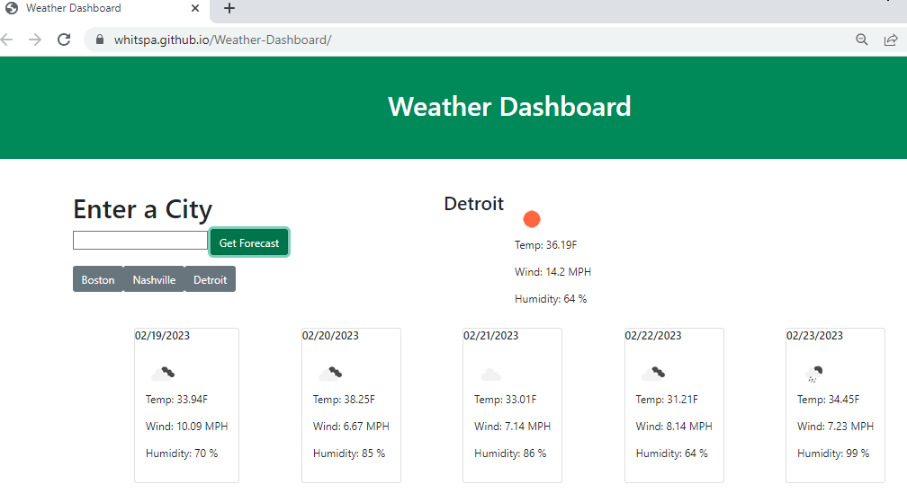

# Weather Dashboard

  []

## Description:
This weather dashboard utilizes the openweather API to allow the user to see the weather outlook for multiple cities. The app runs in the browser and utilizes a script.js file to dynamically update HTML and CSS.

  ## Contents
  
  
  2. [Installation](#installation)
  
  3. [Usage](#usage)
  
  4. [Contributing](#contributing)
  
  5. [Tests](#tests)
  
  
  ## Installation:
  
  clone the repository
  
  ---
  
 ## Usage:
 
 To utilize the weather dashboard, go to the following URL in your browser:
 https://whitspa.github.io/Weather-Dashboard/
  

  ---
  
  
  
  ## License
  
  License used for this project - MIT
  [![License: MIT]](https://opensource.org/licenses/MIT)
  
  ---
  
  ## Contributing:
  
  Please follow these instructions to contribute to the project:
  create pull request from seperate branch and await approval
  
  ---
  
  ## Tests:
  
  no test required. simply run the app
  
  ---
  
 ## Questions
  
  * GitHub Username: WSCoding
  * Link to Github user profile: github.com/whitspa
  * Email Address: whitspa64@duck.com

  ## Link to the deployed application:
    https://whitspa.github.io/Weather-Dashboard/

  A screen shot of the deployed application is below:

